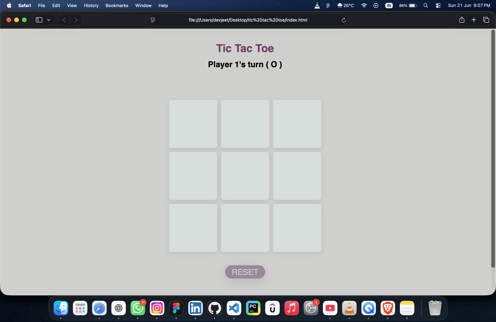

# 🎮 Tic Tac Toe

A modern and responsive Tic Tac Toe game built using **HTML, CSS, and JavaScript**. Play the classic two-player game with a clean UI, smooth animations, and an intuitive user experience.

## 🚀 Live Demo

🔗 https://devjeetdawn14.github.io/tic-tac-toe/

> Replace the link above if your GitHub Pages URL is different.

---

## ✨ Features

- 🎯 Two-player gameplay (X vs O)
- 🔄 Reset game functionality
- 🎨 Modern and clean user interface
- 🖱️ Smooth hover and click animations
- 📱 Responsive design
- ⚡ Fast and lightweight
- 🏆 Automatic win detection
- 🤝 Draw game detection

---

## 📸 Screenshot

---

## 🛠️ Built With

- HTML5
- CSS3
- JavaScript (ES6)

---

## 📂 Repository

🔗 https://github.com/devjeetdawn14/tic-tac-toe

---

## 👨‍💻 Author

**Devjeet Dawn**

⭐ If you like this project, consider giving it a star on GitHub!